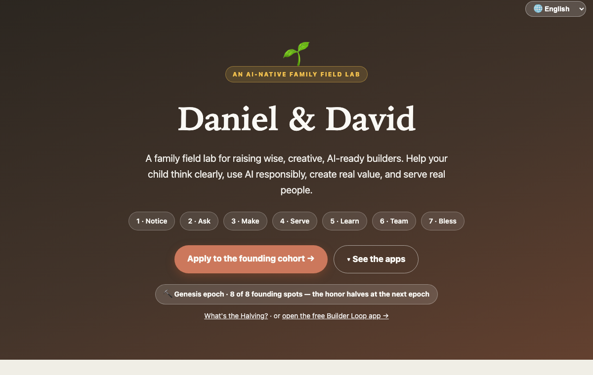
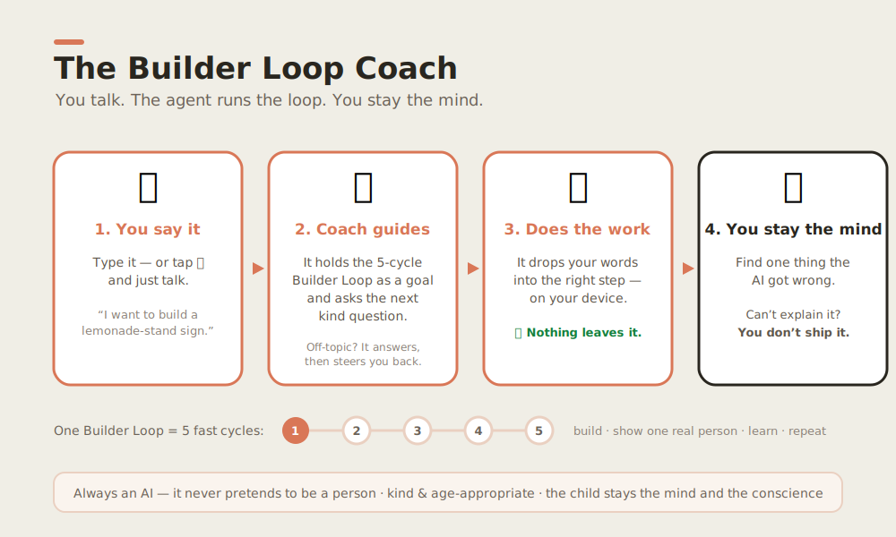
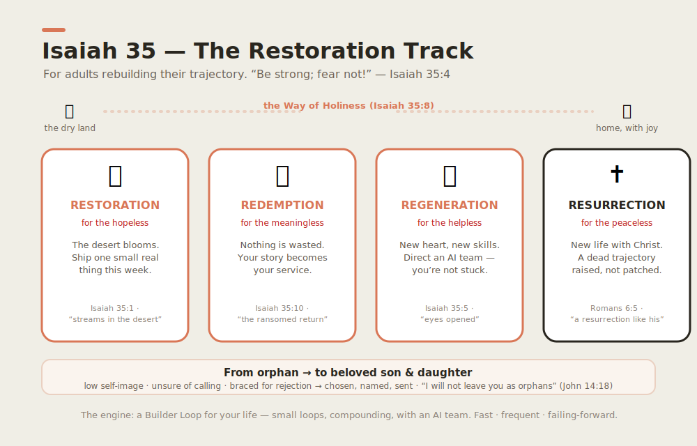

<!-- i18n-source-sha: 861c383ed34c2357 -->
<div align="center">

# 🌱 Daniel &amp; David

**🌐 언어:** [English](README.md) · [中文](README.zh.md) · 한국어 · [日本語](README.ja.md) · [Español](README.es.md) · [Deutsch](README.de.md) · [Français](README.fr.md)

**온 가족이 함께 지혜롭고 창의적이며 AI를 다룰 줄 아는 ‘만드는 사람’이 되는 가족 실습실.**

<a href="https://daniel-and-david.vercel.app/">
  
</a>

**[앱 갤러리 →](https://daniel-and-david.vercel.app/apps.html)** ·
**[Builder Loop 앱 →](https://daniel-and-david.vercel.app/app.html)** ·
**[데모 체험 →](https://daniel-and-david.vercel.app/demos/conversation-spark.html)** ·
**[지원하기 →](https://daniel-and-david.vercel.app/#apply)**

<a href="https://daniel-and-david.vercel.app/">
  
</a>

</div>

> 🌐 **이것은 AI 보조 번역입니다. 영문 [README.md](README.md)가 기준이자 사실의 출처입니다**; 번역은 다소 늦을 수 있습니다.

> **AI는 일의 방식을 크게 바꿀 수 있습니다. 당신과 아이 모두 그것을 두려워할 필요가 없습니다 — 함께라면
> 그보다 더 지혜로워질 수 있습니다.** 이것은 실용적이고 신앙에 기반한 학습 시스템으로, **온 가족**을
> 위한 것입니다 — 어른과 아이(대략 5–15세)가 나란히 — **명확히 사고하고, AI를 책임감 있게 쓰고, 진짜
> 가치를 만들며, 실제 사람을 섬기도록.**

우리는 작은 루프를 하나씩 돕니다. 가장 작은 단위는 **[Builder Loop(빌더 루프)](docs/builder-loop/)** —
**5번의 빠른 ‘만들고-보여주고-배우는’ 사이클**로 진행하는 4주짜리 가족 실험입니다(한 번의 거창한 발표가
아니라): *가장 작은 다음 한 걸음을 고르고 → 거칠게라도 만들고 → 실제 한 사람에게 보여주고 → 무엇이
실패했는지 배우고 → 반복.* 원칙은 **빠르게 · 자주 · 실패하며 전진.** AI는 팀원이고, **당신은 언제나 머리와
양심으로 남습니다** — 어른이든 아이든, 모든 나이에서.

> 🚀 **여기서 시작 → [Builder Loop](docs/builder-loop/)** (무료, 누구나) · 📖 전체 비전이 처음이라면?
> [이야기 읽기](docs/marketing/the-daniel-and-david-story.md) — 10살도 이해할 만큼 쉽고, 회의론자도 납득할 만큼 근거 있게.

> 🧱 **더 깊이 들어오고 싶다면? [창립 가족으로 지원하기](docs/founding-families.md).** 공정하고 정해진
> 일정 위의 드문 영예: 비트코인처럼 창립자의 보상은 매 시기 **반감**되고 코호트는 **두 배**가 됩니다
> (제네시스 = 8가족, 그다음 16, 32, 64 → #121에서 전원 개방). 가장 빠른 = 가장 큰 영예, 가장 빠른 = 가장
> 큰 위험이기에. **현재 모집 중: ⛏️ 제네시스 · 8자리.** **[라이브 사이트](https://wjlgatech.github.io/daniel-and-david/)** 에서 지원하세요.

### 우리가 실제로 오르는 사다리

우리는 돈이 아니라 **역량**을 측정합니다. 이 공개 사다리는 누구든 — 아이*든* 어른*이든* — *해낼 수* 있는 것들입니다:

<p align="center"></p>

*게임은, 오르는 동안 당신이 어떤 사람이 되느냐입니다.*(더 상급의 벤처/돈 트랙도 있지만, 일부러 아래쪽에
둡니다. [두 사다리](docs/vision/milestones.md) 참고.)

### 이것이 되어가는 것: 허브 🌍

이것은 하나의 커리큘럼에서 **[허브](docs/community/hub.md)** 로 자라고 있습니다 — 셋이 하나로:

1. 📚 **살아 있는 학습 허브** — 실제 아이가 쓸 때마다 더 좋아지는 오픈 커리큘럼.
2. 🧰 **도구 허브** — 사람에게 가르치는 모든 역량을 우리 AI에게도 가르칩니다(스킬·플러그인·워크플로·훅), 전부 오픈·설치형.
3. 🤝 **협업 허브** — AI와 사람이 아이디어를 나누고, *팀을 이루며*, 근본 문제를 푸는 프로젝트를 시작하는 곳.

**부모, 아이, 엔지니어, 디자이너, 창업자, 그리고 AI 에이전트 모두 환영합니다.** 풀 만한 문제를 가져오세요 —
**[허브 가이드](docs/community/hub.md)** 와 [CONTRIBUTING.md](CONTRIBUTING.md) 를 보세요.

### 설계 중: 대화로 끝까지 — Builder Loop Coach 🗣️

오늘의 Builder Loop는 탭으로 진행하는 앱입니다. 우리는 **두 번째 문**을 설계하고 있습니다: 음성 우선의
**대화형 코치** — *말로* 같은 루프를 돕니다. 당신이 말하면 AI 에이전트가 다섯 사이클을 안내하고 잡일을
대신하며, 당신은 머리로 남습니다. **아직 설계 중이며 출시 전**입니다(에이전트는 데이터를 **기기 내에서**
처리하고, 항상 자신이 AI임을 분명히 밝힙니다). 계획과 실행법: [`apps/web-agent/`](apps/web-agent/).

<p align="center"></p>

### 설계 중: 어른에게도 열림 — 이사야 35장 회복의 길 🌿

아이를 만드는 사람으로 바꾸는 그 엔진은, **메마른 계절을 지나는 어른**에게 꼭 필요한 바로 그것입니다 —
AI에 일자리가 흔들린 사람, 여유 없는 한부모, *피부는 늙었어도 마음은 젊은* 사람, ‘고아의 마음’을 지녔거나
우울의 네 거짓말(*절망·무력·무의미·불안*)과 싸우는 사람. 그래서 우리는 **이사야 35장**에 뿌리내린
**병행, 성인 전용 트랙**을 엽니다 — *“약한 손을 강하게 하며 … 겁내는 자에게 이르기를 굳세어라, 두려워하지
말라.”* 네 가지 운영 원리 — **회복(Restoration)·구속(Redemption)·중생(Regeneration)·부활(Resurrection)** —
같은 Builder Loop로 돌려 역량·소명·소망을 다시 세웁니다(인생 궤적의 진짜 *12배 도약*). 신앙에 뿌리내렸고
(그리스도 중심의 회복), 늘 그렇듯 **어떤 믿음을 가졌든 모두 환영합니다.** **설계 중, 출시 전** → 
[회복의 길](docs/vision/isaiah-35-restoration.md) 을 읽거나, **[4주 회복 루프](docs/curriculum/adult-restoration/)** 를
실천하세요(주마다 하나의 R, 주마다 진짜 작은 결과 하나 — 인쇄용 [워크시트](docs/curriculum/adult-restoration/worksheet.md)).
아이가 핵심이며, 모든 [아동 안전 규칙](docs/safety/)은 그대로입니다.

<p align="center"></p>

---

## 왜 이 프로젝트가 존재하는가

대부분은 일자리를 *찾으라고* 배웁니다. 우리는 가치를 *만드는 법*을 배웁니다 — 사람들이 정말 필요로 하는
것을 만들고, 정직하게 하고, 돌아오는 것을 잘 청지기하는 법. 아이는 이것을 강의가 아니라 **AI 팀과 함께
진짜 하나를 처음부터 끝까지 만들며** 배웁니다. [`docs/vision/mission.md`](docs/vision/mission.md) 와
[변화 이론](docs/vision/theory-of-change.md) 을 보세요 — 인과 모델과 우리가 실제로 추적하는 지표
(*아이 1인당 월별 ‘독립적 만들기 증거’*, 돈이나 별이 아니라).

> **더 깊은 목표.** 우리는 축복하기 위해 만듭니다. 여기 모든 벤처는 얼마를 버느냐만이 아니라, 누구를 섬기고
> 타인에게 무엇을 가능케 하느냐로 측정됩니다. [`docs/principles/values.md`](docs/principles/values.md).

> **나이 든 학습자와 부모께:** 장기적인 *벤처 트랙* — $1M→$10B 마일스톤 사다리 — 도 있지만 일부러
> 헤드라인이 **아닙니다.** 약속이 아니라 나침반이며, 우리가 앞세우는 역량 사다리 아래
> [`docs/vision/milestones.md`](docs/vision/milestones.md) 에 있습니다.

---

## 부를 창조하는 사람은 실제로 이렇게 만들어진다

강의로가 아니라. **진짜 하나를 처음부터 끝까지 만들고, 왜 됐고 안 됐는지 그 모든 부분을 배우며.** 그래서 이
저장소는 *커리큘럼*과 *진짜 벤처*를 짝지웁니다.

<p align="center"></p>

### 벤처들

공개적으로 설계하는 진짜 사업. 첫 번째의 전체 계획이 이 저장소에 있으며 — 단계도 정직하게 밝힙니다:
**운영 사양은 완료, 빌드는 아직 시작 전**(파일럿 설계 중).

- 🏕️ **[`ventures/kc-matchday-basecamp/`](ventures/kc-matchday-basecamp/)** — 캔자스시티의 글로벌
  축구 여름을 위한 *합법적이고 장소 제휴형인 ‘팬 유틸리티 + 로컬 커머스’* 콘셉트. 완전한 운영 사양, 경제성,
  컴플라이언스 게이트, 그리고 만들 수 있는 웹앱 PRD — **사양 ✅ 완료, 웹앱 🟡 빌드 미시작.** 1번 벤처입니다:
  두 아이가 처음으로 *계획적으로* 수요·마진·출하를 맛보는 일.(교육 수단은 [Builder Loop](docs/builder-loop/)
  — 벤처가 나오기 전에도 거기서 시작하세요.)

### 커리큘럼

하나의 방법, **모든 나이** — 학습지가 아니라 진짜 만들기에 묶여 있습니다.

**아이들을 위해**(진짜 벤처에 연결):

- 👦 **[Daniel — 11세](docs/curriculum/daniel-age-11/)** — 만들고, 가격을 매기고, 팔고, 측정하고, 손익을
  읽습니다. AI 짝과 코드를 씁니다.(이제 [AI 빌드 키트](docs/curriculum/daniel-age-11/build-kit.md): 만들고 →
  멘토에게 보여주고 → 어른과 함께 팝니다.)
- 🧒 **[David — 6세](docs/curriculum/david-age-6/)** — 세고, 간판을 그리고, 손님을 맞이하며, *사람에게 좋은
  것을 만드는 것*이 전부임을 배웁니다.

**어른들을 위해** — 성인 전용 [회복의 길](docs/vision/isaiah-35-restoration.md), 4주
[회복 루프](docs/curriculum/adult-restoration/)로 진행(*피부는 늙어도 마음은 젊은* 분 환영). 같은 Builder
Loop를, 한 인생을 다시 세우는 데로:

- 👩‍👧 **한부모** — 진짜 통점 하나를 찾아 AI 팀과 작은 유료 제품을 출시하고 첫 *“네”*를 얻습니다. 이력서보다 회복.
- 👨‍💻 **흔들린 전문가**(AI가 막 바꾼 그 직무) — 힘들게 쌓은 노하우를 제품으로; 한때 부서가 필요하던 일을 AI 팀을 지휘해.
- 👵 **노련한 멘토**(교사·관리자·은퇴자) — 평생의 지혜를 사람을 섬기는(그리고 팔리는) 무언가로. 늦지 않았다는 증거.
- 🚗 **젊은 분투가**(기사·서버·긱 워커) — 부업을 반복 가능한 제품으로; 마진·수요·레버리지를 배웁니다.

> 모든 성인 트랙은 같은 엔진을 네 개의 R로 돌립니다 — **회복 · 구속 · 중생 · 부활**(이사야 35장). *설계 중.*

### 원칙

우리가 일하는 방식 — 최고의 AI-네이티브 회사들과 같게:

- 🤖 [AI-네이티브 회사](docs/principles/ai-native-company.md) — 에이전트는 기능이 아니라 팀원입니다.
- 🛠️ [에이전틱 엔지니어링](docs/principles/agentic-engineering.md) — 작고 되돌릴 수 있는 변경, 느낌보다 평가, 문서는 코드처럼, 사람이 편집자.
- 🔎 [Pain2Gain](docs/principles/pain2gain.md) — 통점을 *근본 원인 / 제1원리* 깊이로 이해(깊이 사다리, 5-Why, 6차원, 부담)해 해법이 변혁적이도록.
- ✝️ [가치관](docs/principles/values.md) — 이 모든 것 아래의 *왜*.

<p align="center"></p>

### 모든 빌더에게 필요한 사고 도구

무엇을 만들고, 사고, 믿고, 팔기 전에 — **그것을 심문하세요.** 우리는 **5W1H 비판적 사고 격자**를 씁니다:
어떤 주장·계획·제품에든 겨눌 수 있는 여섯 질문어로, 숨은 위험과 검증되지 않은 가정을 드러냅니다. 두 아이에게
가르치고([🧠 비판적 사고](docs/curriculum/critical-thinking/) — David의 ‘여섯 탐정 단어’와 Daniel의 응용판),
[우리 AI 팀원에게도 내장](.claude/README.md)했습니다(스킬·워크플로·훅·플러그인) — 사람과 에이전트가 같은
방식으로 생각하도록.

<p align="center"></p>

---

## 저장소 지도

```
daniel-and-david/
├── docs/
│   ├── builder-loop/    ⭐ 4주 가족 Builder Loop — 가장 작은 단위. 여기서 시작.
│   ├── founding-families.md  🧱 ‘반감(The Halving)’ — 창립 코호트 지원(드물고 공정하고 고정)
│   ├── vision/          미션, 변화 이론 + 북극성 지표, 두 사다리
│   ├── safety/          아동 안전, 프라이버시, 동의, 모더레이션, AI 사용 경계
│   ├── principles/      우리가 일하는 법: AI-네이티브 + 에이전틱 엔지니어링 + 가치관
│   ├── curriculum/      여러 트랙: Daniel(11), David(6) + 성인 회복 + 사고 도구
│   ├── marketing/       장문의 이야기 + 바로 올릴 LinkedIn 글
│   ├── community/       허브 가이드 — AI와 사람이 교류하고 팀을 이루는 법
│   └── assets/          인포그래픽(SVG) — 이 README의 시각 자료
├── FOUNDERS.md          창립 가족 공개 명부(가명, 동의 하)
├── ventures/
│   └── kc-matchday-basecamp/   1번 벤처 — 전체 사양, 경제성, 앱 PRD
├── apps/
│   ├── web/             랜딩 페이지 + privacy.html — 호스팅됨, 창립 코호트 폼 포함
│   └── web-agent/       Builder Loop Coach(대화형 코치, 설계 중)
├── agents/
│   └── hello-agent/     작고 읽기 쉬운 입문 에이전트 — 당신의 첫 AI 팀원
├── .claude/             에이전트 툴킷 — 스킬·워크플로·훅(AI 팀원을 위한 역량)
├── tools/               설치형 플러그인(예: 비판적 사고 플러그인)
├── packages/            벤처가 커지며 공유되는 코드
├── scripts/             설치·도우미 스크립트
└── .github/             이슈/PR 템플릿, CI, 기여자 온램프
```

---

## 여기서 시작 — 당신의 길을 고르세요

### 👪 가족을 위해(코드·설치 불필요)

GitHub도 git도 어떤 설정도 필요 없습니다. 그저:

1. **홈페이지 열기:** **[웹에서 daniel-and-david 열기 →](https://wjlgatech.github.io/daniel-and-david/)**(평범한 링크, 어떤 브라우저든). **“See it work”** 섹션이 세 데모를 *페이지에서 바로, 실시간으로* 돌립니다 — 더 읽기 전에 하나 해 보세요.
2. **무료 [Builder Loop 앱](https://wjlgatech.github.io/daniel-and-david/app.html) 열기** — **원클릭·가입 불필요** 웹앱으로 온 가족을 5 사이클로 안내하고 진행을 기록하며 **홈 화면에 설치**됩니다(오프라인 가능, 모든 것이 기기 내 보관). 종이가 좋다면 [인쇄용](docs/builder-loop/printable.md)과 [반복 일지](docs/builder-loop/iteration-log.md), 그리고 전체 [Builder Loop 가이드](docs/builder-loop/)가 있습니다.
3. **[앱 갤러리](https://wjlgatech.github.io/daniel-and-david/apps.html) 둘러보기** — 모든 작은 앱을 한곳에, 각각 작은 [Agentic App Card](docs/agentic-app-card.md)로 설명(HuggingFace 모델 카드처럼, 약 10배 더 단순). [Conversation Spark](https://wjlgatech.github.io/daniel-and-david/demos/conversation-spark.html), [Transition Timer](https://wjlgatech.github.io/daniel-and-david/demos/transition-timer.html), [Homework Chunker](https://wjlgatech.github.io/daniel-and-david/demos/homework-chunker.html) 를 해 보거나, 직접 만들어 카드를 추가하세요.
4. 시작 전 **[안전 규칙](docs/safety/)** 을 읽으세요(동의, 프라이버시, AI 경계).
5. **아이의 트랙 열기:** [Daniel (11)](docs/curriculum/daniel-age-11/) · [David (6)](docs/curriculum/david-age-6/).
6. **더 깊이?** [창립 가족 지원](docs/founding-families.md) — 현재 ⛏️ 제네시스(8자리). 영예는 매 시기 반감되니, 다음 반감 전에 지원하세요.

이것이 입구의 전부입니다. 부모에게 필요한 모든 것은 평범한 웹 링크나 한 페이지의 markdown입니다.

### 🛠️ 개발자·기여자·창립 가족을 위해 — 원클릭 설치

```bash
git clone https://github.com/wjlgatech/daniel-and-david.git && cd daniel-and-david
./scripts/setup.sh        # ← 한 명령: 스크립트 실행 권한 + 모든 가드레일 점검 실행
```

`setup.sh`는 다시 실행해도 안전합니다. [Claude Code](https://claude.ai/code)를 감지하고 **이 저장소가
제공하는 AI 툴킷**을 안내합니다 — 원클릭 설치, 전역 설정 불필요:

- **`/goal-10x`** — 목표 드라이버: 리서치 → 저장소 자체 점검에 맞춰 어떤 목표든 ‘초록불’로 → 코칭 → 자기개선. 프로젝트 명령으로 동봉(`.claude/commands/goal-10x.md`), 클론 후 바로 작동.
- **`/check`** — CI와 같은 방식으로 다섯 가드레일(links · toolkit · status-truth · registration-safety · webapp) 전부 실행.
- **`critical-thinking` 플러그인**(5W1H 격자를 명령 + 스킬 + 훅으로). 이 저장소의 마켓플레이스에서 설치:
  ```text
  /plugin marketplace add wjlgatech/daniel-and-david
  /plugin install critical-thinking@daniel-and-david
  ```

그다음: 로컬에서 랜딩 페이지 열기(`open apps/web/public/index.html`), **[AGENTS.md](AGENTS.md)** 와
**[.claude/README.md](.claude/README.md)** 읽기, PR 전 `./scripts/check.sh` 실행.

> 🧱 **창립 가족은 오픈 툴킷 이상을 받습니다** — 스튜디오 자체 AI 워크숍(AnyAgent, Super U, DreamMakeTrue)의
> 비공개 선체험. [**창립 가족**](docs/founding-families.md) 참고.

처음이세요? **[CONTRIBUTING.md](CONTRIBUTING.md)** 부터. 기여는 범위가 분명한 이슈를 중심으로 — 작고, 명확하고,
리뷰 가능하고, 친절하며, **안전**하게(아이가 관련됨 — [`docs/safety/`](docs/safety/) 참고). 가까운 목표는 기여
*양*이 아니라, 이 루프가 아이의 행동을 바꾼다는 증거입니다: **열 가족이 진짜 [Builder Loop](docs/builder-loop/)
하나를 끝내기.**(더 큰 오픈 허브는 *나중* 단계 — [변화 이론](docs/vision/theory-of-change.md)과
[허브 가이드](docs/community/hub.md) 참고.)

---

## 우리가 지키는 기준

<p align="center"></p>

- **언제나 합법적이고 정직하게.** 1번 벤처에 명확한 컴플라이언스 게이트와 ‘하지 말 것’ 목록이 있는 데는 이유가 있습니다. 지름길이 아니라 신뢰로 이깁니다.
- **작게, 진짜를 출시.** 작동하는 것이 완벽한 계획을 이깁니다.
- **만들며 가르친다.** 6살이 *왜*를 못 잡으면, 우리가 더 잘 설명해야 합니다.
- **자라며 나눈다.** 관대함은 나중에 붙이는 게 아니라 모델에 내장돼 있습니다.

---

## 라이선스

[MIT](LICENSE) — 공개적으로 만들고, 자유롭게 배우며, 자유롭게 그 위에 빌드하세요.

---

<p align="center"><i>좋은 것을 만드세요. 그것이 돈이 되게 하세요. 그것으로 축복하세요. — Daniel과 David에게</i></p>
