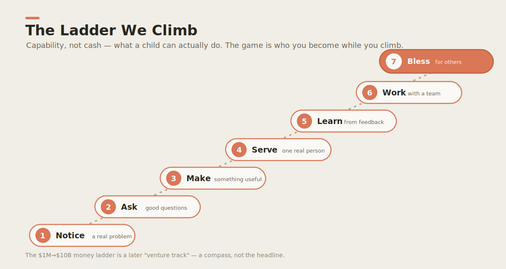
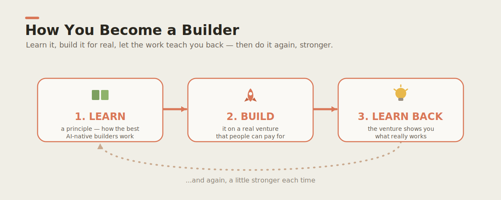
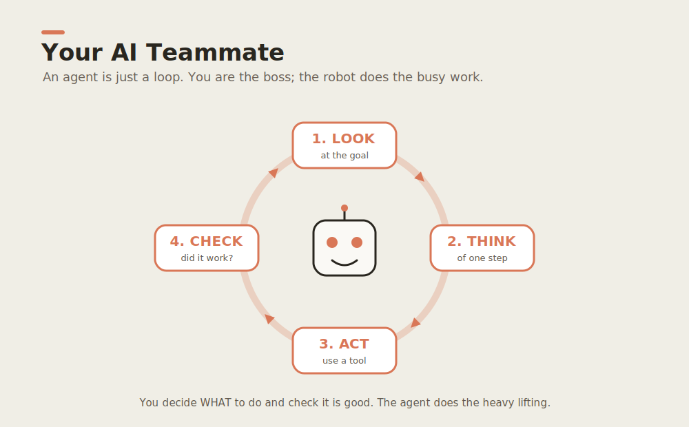
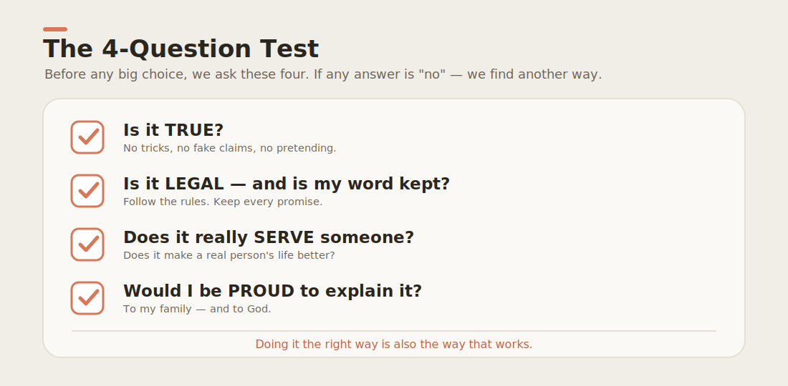

# Daniel & David

### A family field lab for raising wise, creative, AI-ready builders.

🌐 **The [live site](https://wjlgatech.github.io/daniel-and-david/) speaks your language** — switch
with the selector: **English · 中文 · Español · 한국어 · 日本語**. (English is canonical; the rest are
AI-assisted — corrections welcome. See [`docs/i18n/`](docs/i18n/).)

> **AI may change work dramatically. Your child doesn't need to be afraid of it — your child
> needs to become wiser than it.** This is a practical, faith-informed learning system for
> families who want to help children (roughly ages 5–15) **think clearly, use AI responsibly,
> create real value, and serve real people.**

We do that one small loop at a time. The atomic unit is the **[Builder Loop](docs/builder-loop/)** —
a four-week family experiment run as **5 fast build-show-learn cycles** (not one big reveal):
*pick the smallest next thing → build it rough → show one real person → learn what failed →
repeat.* The principle is **fast · frequent · failing-forward.** AI is the child's teammate; the
child stays **the mind and the conscience.**

> 🚀 **Start here → [The Builder Loop](docs/builder-loop/)** (free, for everyone) · 📖 New to the
> whole vision? [Read the story](docs/marketing/the-daniel-and-david-story.md) — simple enough for
> a 10-year-old, cited enough for a skeptic.

> 🧱 **Want in deeper? [Apply to be a Founding Family](docs/founding-families.md).** A rare
> privilege on a fair, fixed schedule: like Bitcoin, the founder's reward **halves** each epoch
> while the cohort **doubles** (Genesis = 8 families, then 16, 32, 64 → open to all at #121).
> Earliest = most honor, because earliest = most risk. **Currently open: ⛏️ Genesis · 8 spots.**
> Apply on the **[live site](https://wjlgatech.github.io/daniel-and-david/)**.

### The ladder we actually climb

We measure **capability**, not dollars. The public ladder is what a child can *do*:

<p align="center"></p>

*The game is who you become while you climb.* (There's an advanced venture/money track too —
it lives lower down, on purpose. See [the ladders](docs/vision/milestones.md).)

### What this is becoming: a hub 🌍

This is growing from a curriculum into a **[hub](docs/community/hub.md)** — three in one:

1. 📚 **A living learning hub** — open curriculum that improves every time a real child uses it.
2. 🧰 **A tools hub** — every capability we teach a human, we teach our AIs too (skills, plugins,
   workflows, hooks), all open and installable.
3. 🤝 **A collaboration hub** — where AI and people exchange ideas, *match into teams,* and launch
   ventures that solve foundational problems.

**Parents, kids, engineers, designers, founders, and AI agents are all invited.** Bring a problem
worth solving — see **[the Hub guide](docs/community/hub.md)** and [CONTRIBUTING.md](CONTRIBUTING.md).

---

## Why this exists

Most people are taught to *find* a job. We are learning to *create* value — to make something
people genuinely need, do it honestly, and steward what comes back well. A child learns that
not from a lecture but from **building one real thing, end to end**, with an AI team at their
side. See [`docs/vision/mission.md`](docs/vision/mission.md) and our
[Theory of Change](docs/vision/theory-of-change.md) — the causal model and the metric we
actually track (*Independent Builder Evidence per child per month*, not dollars or stars).

> **The deeper aim.** We build to bless. Every venture here is measured not only by what
> it earns, but by who it serves and what it makes possible for others. See
> [`docs/principles/values.md`](docs/principles/values.md).

> **Older learners & parents:** there's a long-horizon *venture track* — a $1M→$10B milestone
> ladder — but it's deliberately **not** the headline. It's a compass, not a promise, and it
> lives in [`docs/vision/milestones.md`](docs/vision/milestones.md) under the Capability Ladder
> we lead with.

---

## How a wealth creator is actually made

Not from a lecture. From **building one real thing, end to end, and learning every part
of why it worked or didn't.** So this repo pairs *curriculum* with *real ventures*.

<p align="center"></p>

### The ventures
Real businesses, designed in the open. The first one's full plan lives in this repo — and we're
honest about its stage: **the operating spec is complete; the build hasn't started yet** (pilot
in design).

- 🏕️ **[`ventures/kc-matchday-basecamp/`](ventures/kc-matchday-basecamp/)** — a *legal,
  venue-partnered fan-utility + local-commerce* concept for Kansas City's global-football
  summer. Full operating spec, economics, compliance gates, and a buildable web-app PRD —
  **spec ✅ complete, web app 🟡 build not started.** This is venture #1: the boys' first
  *planned* taste of demand, margin, and shipping. (The teaching vehicle is the
  [Builder Loop](docs/builder-loop/) — start there even before the venture ships.)

### The curriculum
Two tracks, age-appropriate, tied to the live ventures:

- 👦 **[Daniel — age 11](docs/curriculum/daniel-age-11/)** — builds, prices, sells, measures,
  and reads a P&L. Writes code with an AI pair.
- 🧒 **[David — age 6](docs/curriculum/david-age-6/)** — counts, draws the signs, greets the
  customer, learns that *making something good for people* is the whole game.

### The principles
How we work — the same way the best AI-native companies work:

- 🤖 [AI-Native Company](docs/principles/ai-native-company.md) — agents are teammates, not features.
- 🛠️ [Agentic Engineering](docs/principles/agentic-engineering.md) — small reversible changes,
  evals over vibes, docs-as-code, the human stays the editor.
- 🔎 [Pain2Gain](docs/principles/pain2gain.md) — understand a pain at *root-cause / first-principle*
  depth (the depth ladder, 5-Why, the 6 dimensions, burden) so the solution is transformative.
- ✝️ [Values](docs/principles/values.md) — the *why* under all of it.

<p align="center"></p>

### The thinking tool every builder needs

Before you build, buy, believe, or sell anything — **interrogate it.** We use the **5W1H
critical-thinking grid**: six question-words you point at any claim, plan, or product to surface
hidden risks and untested assumptions. It's taught to the boys
([🧠 Critical Thinking](docs/curriculum/critical-thinking/) — David's "Six Detective Words" and
Daniel's applied version) and [wired into our AI teammates](.claude/README.md) as a skill,
workflow, hook, and plugin — so humans and agents think the same way.

<p align="center"></p>

---

## Repository map

```
daniel-and-david/
├── docs/
│   ├── builder-loop/    ⭐ The 4-week family Builder Loop — the atomic unit. Start here.
│   ├── founding-families.md  🧱 The Halving — apply to the founding cohort (rare, fair, fixed)
│   ├── vision/          Mission, Theory of Change + North Star, and the two ladders
│   ├── safety/          Child-safety, privacy, consent, moderation, AI-use boundaries
│   ├── principles/      How we work: AI-native + agentic engineering + values
│   ├── curriculum/      Two tracks: Daniel (11) and David (6) + thinking tools
│   ├── marketing/       The long-form story + ready-to-post LinkedIn posts
│   ├── community/       The Hub guide — how AI + people exchange ideas and match
│   └── assets/          Infographics (SVG) — the visuals in this README
├── FOUNDERS.md          The public ledger of founding families (by alias, with consent)
├── ventures/
│   └── kc-matchday-basecamp/   Venture #1 — full spec, economics, app PRD
├── apps/
│   └── web/             Landing page + privacy.html — hosted, with the founding-cohort form
├── agents/
│   └── hello-agent/     A tiny, readable starter agent — your first AI teammate
├── .claude/             Agent toolkit — skills, workflows, hooks (capabilities for AI teammates)
├── tools/               Installable plugins (e.g. the critical-thinking plugin)
├── packages/            Shared code as ventures grow
├── scripts/             Setup and helper scripts
└── .github/             Issue/PR templates, CI, and the contributor on-ramp
```

---

## Start here — pick your path

### 👪 For families (no code, no install)

You don't need GitHub, git, or any setup. Just:

1. **Open the home page:** **[daniel-and-david on the web →](https://wjlgatech.github.io/daniel-and-david/)** (a normal link — opens in any browser).
2. **Open the free [Builder Loop app](https://wjlgatech.github.io/daniel-and-david/app.html)** — a **1-click, no-signup** web app that walks your family through the 5 cycles, tracks progress, and **installs to your home screen** (works offline; everything stays on your device). Prefer paper? There's a [printable](docs/builder-loop/printable.md) and an [iteration log](docs/builder-loop/iteration-log.md), and the full [Builder Loop guide](docs/builder-loop/).
3. **Browse the [Apps Gallery](https://wjlgatech.github.io/daniel-and-david/apps.html)** — every small app in one place, each described by a tiny [Agentic App Card](docs/agentic-app-card.md) (like a HuggingFace model card, ~10× simpler). Play [Conversation Spark](https://wjlgatech.github.io/daniel-and-david/demos/conversation-spark.html), the [Transition Timer](https://wjlgatech.github.io/daniel-and-david/demos/transition-timer.html), or the [Homework Chunker](https://wjlgatech.github.io/daniel-and-david/demos/homework-chunker.html) — or build your own and add a card.
4. **Read the [safety rules](docs/safety/)** before you start (consent, privacy, AI boundaries).
5. **Open your child's track:** [Daniel (11)](docs/curriculum/daniel-age-11/) · [David (6)](docs/curriculum/david-age-6/).
6. **Want in deeper?** [Apply to be a Founding Family](docs/founding-families.md) — currently
   ⛏️ Genesis (8 spots). The honor halves at each epoch; apply before the next halving.

That's the whole on-ramp. Everything a parent needs is a plain web link or a markdown page.

### 🛠️ For developers, contributors & founding families — 1-click setup

```bash
git clone https://github.com/wjlgatech/daniel-and-david.git && cd daniel-and-david
./scripts/setup.sh        # ← the one command: makes scripts runnable + runs every guardrail
```

`setup.sh` is safe to re-run. It detects [Claude Code](https://claude.ai/code) and points you at
the **AI toolkit this repo ships** — installable in one click, no global setup:

- **`/goal-10x`** — the objective driver: research → drive any goal to green against the repo's
  own checks → coach → self-improve. Ships as a project command (`.claude/commands/goal-10x.md`),
  so it just works after you clone.
- **`/check`** — run all five guardrails (links · toolkit · status-truth · registration-safety ·
  webapp) the same way CI does.
- **The `critical-thinking` plugin** (the 5W1H grid as a command + skill + hook). Install it from
  this repo's own marketplace:
  ```text
  /plugin marketplace add wjlgatech/daniel-and-david
  /plugin install critical-thinking@daniel-and-david
  ```

Then: open the landing page locally (`open apps/web/public/index.html`), read **[AGENTS.md](AGENTS.md)**
and **[.claude/README.md](.claude/README.md)**, and run `./scripts/check.sh` before any PR.

> 🧱 **Founding families get more than the open toolkit** — private early access to the studio's
> own AI workshop (AnyAgent, Super U, DreamMakeTrue). See
> [**Founding Families**](docs/founding-families.md).

New here? Start with **[CONTRIBUTING.md](CONTRIBUTING.md)**. Contributions open around tightly
scoped issues — small, clear, reviewable, kind, and **safe** (children are involved — see
[`docs/safety/`](docs/safety/)). Our near-term goal isn't contribution *volume*; it's proof
that the loop changes a child's behavior: **ten families finishing one real
[Builder Loop](docs/builder-loop/).** (A bigger open hub is a *later* stage — see the
[Theory of Change](docs/vision/theory-of-change.md) and the [Hub guide](docs/community/hub.md).)

---

## The standard we hold

<p align="center"></p>

- **Legal and honest, always.** Venture #1 has explicit compliance gates and a "do-not"
  list for a reason. We win by being trustworthy, not by cutting corners.
- **Ship small, ship real.** A working thing beats a perfect plan.
- **Teach while you build.** If a 6-year-old can't grasp the *why*, we explain better.
- **Give as you grow.** Generosity is built into the model, not bolted on later.

---

## License

[MIT](LICENSE) — built in the open, free to learn from, free to build on.

---

<p align="center"><i>Build something good. Make it pay. Use it to bless. — for Daniel & David</i></p>
