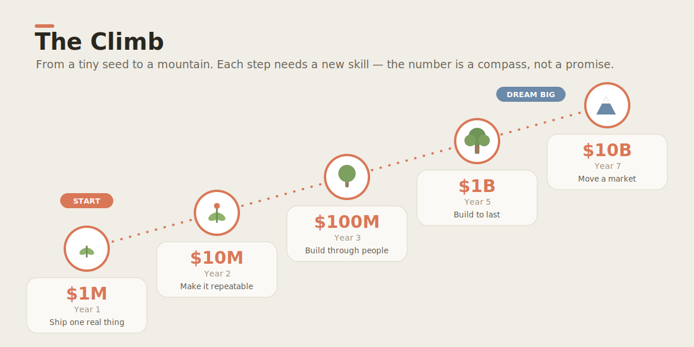

# Daniel & David

> A father's workshop for raising two boys — **Daniel (11)** and **David (6)** — into the
> next generation of wealth creators, builders, and servants of the Kingdom of God.

This repository is a **venture studio + learning academy in one**. It is run like an
**AI-native company** and built with **agentic engineering** from day one, so that two
kids — and eventually contributors from all over the world — can learn to ship real
products, create real value, and steward it for a purpose bigger than themselves.

<p align="center"></p>

> 📖 **New here? Read [the story](docs/marketing/the-daniel-and-david-story.md)** — the whole vision,
> simple enough for a 10-year-old, cited enough for a skeptic (every claim backed by a study or a
> scripture).

### What this is becoming: a hub 🌍

This is growing from a curriculum into a **[hub](docs/community/hub.md)** — three in one:

1. 📚 **A living learning hub** — open curriculum that improves every time a real child uses it.
2. 🧰 **A tools hub** — every capability we teach a human, we teach our AIs too (skills, plugins,
   workflows, hooks), all open and installable.
3. 🤝 **A collaboration hub** — where AI and people exchange ideas, *match into teams,* and launch
   ventures that solve foundational problems.

**Parents, kids, engineers, designers, founders, and AI agents are all invited.** Bring a problem
worth solving — see **[the Hub guide](docs/community/hub.md)** and [CONTRIBUTING.md](CONTRIBUTING.md).

---

## Why this exists

Most people are taught to *find* a job. We are learning to *create* value.

The goal we are training toward, out loud and on purpose:

| Milestone | Target | Horizon | What it really teaches |
|---|---:|---|---|
| 🌱 Seed | **$1M** | Year 1 | Ship one real product people pay for |
| 🌿 Sprout | **$10M** | Year 2 | Repeatable system, not luck |
| 🌳 Tree | **$100M** | Year 3 | Teams, leverage, distribution |
| 🌲 Forest | **$1B** | Year 5 | Build an institution that outlives you |
| ⛰️ Mountain | **$10B** | Year 7 | Move an entire market |

These numbers are a **compass, not a promise.** What's non-negotiable is the *character*
the journey builds: courage, honesty, craftsmanship, generosity, and faith. Money is a
**tool and a test** — we learn to make it well and give it well. See
[`docs/vision/mission.md`](docs/vision/mission.md).

> **The deeper aim.** We build to bless. Every venture here is measured not only by what
> it earns, but by who it serves and what it makes possible for others. See
> [`docs/principles/values.md`](docs/principles/values.md).

---

## How a wealth creator is actually made

Not from a lecture. From **building one real thing, end to end, and learning every part
of why it worked or didn't.** So this repo pairs *curriculum* with *real ventures*.

<p align="center"></p>

### The ventures
Real businesses, built in the open. The first one is live in this repo:

- 🏕️ **[`ventures/kc-matchday-basecamp/`](ventures/kc-matchday-basecamp/)** — a *legal,
  venue-partnered fan-utility + local-commerce* business launching around Kansas City's
  global-football summer. Full operating spec, economics, compliance gates, and a buildable
  web-app PRD. **This is venture #1 — the boys' first taste of demand, margin, and shipping.**

### The curriculum
Two tracks, age-appropriate, tied to the live ventures:

- 👦 **[Daniel — age 11](docs/curriculum/daniel-age-11/)** — builds, prices, sells, measures,
  and reads a P&L. Writes code with an AI pair.
- 🧒 **[David — age 6](docs/curriculum/david-age-6/)** — counts, draws the signs, greets the
  customer, learns that *making something good for people* is the whole game.

### The principles
How we work — the same way the best AI-native companies work:

- 🤖 [AI-Native Company](docs/principles/ai-native-company.md) — agents are teammates, not features.
- 🛠️ [Agentic Engineering](docs/principles/agentic-engineering.md) — small reversible changes,
  evals over vibes, docs-as-code, the human stays the editor.
- ✝️ [Values](docs/principles/values.md) — the *why* under all of it.

<p align="center"></p>

### The thinking tool every builder needs

Before you build, buy, believe, or sell anything — **interrogate it.** We use the **5W1H
critical-thinking grid**: six question-words you point at any claim, plan, or product to surface
hidden risks and untested assumptions. It's taught to the boys
([🧠 Critical Thinking](docs/curriculum/critical-thinking/) — David's "Six Detective Words" and
Daniel's applied version) and [wired into our AI teammates](.claude/README.md) as a skill,
workflow, hook, and plugin — so humans and agents think the same way.

<p align="center"></p>

---

## Repository map

```
daniel-and-david/
├── docs/
│   ├── vision/          Mission and the milestone ladder ($1M → $10B)
│   ├── principles/      How we work: AI-native + agentic engineering + values
│   ├── curriculum/      Two tracks: Daniel (11) and David (6) + thinking tools
│   ├── marketing/       The long-form story + ready-to-post LinkedIn posts
│   ├── community/       The Hub guide — how AI + people exchange ideas and match
│   └── assets/          Infographics (SVG) — the visuals in this README
├── ventures/
│   └── kc-matchday-basecamp/   Venture #1 — full spec, economics, app PRD
├── apps/
│   └── web/             The academy's own landing page (open it in a browser)
├── agents/
│   └── hello-agent/     A tiny, readable starter agent — your first AI teammate
├── .claude/             Agent toolkit — skills, workflows, hooks (capabilities for AI teammates)
├── tools/               Installable plugins (e.g. the critical-thinking plugin)
├── packages/            Shared code as ventures grow
├── scripts/             Setup and helper scripts
└── .github/             Issue/PR templates, CI, and the contributor on-ramp
```

---

## Quick start (for a kid, a parent, or a contributor anywhere on Earth)

```bash
# 1. Get the code
git clone https://github.com/wjlgatech/daniel-and-david.git
cd daniel-and-david

# 2. Open the academy's home page — no install needed
open apps/web/public/index.html      # macOS  (Linux: xdg-open, Windows: start)

# 3. Read the mission, then the first venture
#    docs/vision/mission.md   →   ventures/kc-matchday-basecamp/README.md

# 4. Find a "good first issue" and make your first contribution
#    https://github.com/wjlgatech/daniel-and-david/contribute
```

New here? Start with **[CONTRIBUTING.md](CONTRIBUTING.md)**. We are designed for **100
contributions a day from around the world** — small, clear, reviewable, kind.

---

## The standard we hold

<p align="center"></p>

- **Legal and honest, always.** Venture #1 has explicit compliance gates and a "do-not"
  list for a reason. We win by being trustworthy, not by cutting corners.
- **Ship small, ship real.** A working thing beats a perfect plan.
- **Teach while you build.** If a 6-year-old can't grasp the *why*, we explain better.
- **Give as you grow.** Generosity is built into the model, not bolted on later.

---

## License

[MIT](LICENSE) — built in the open, free to learn from, free to build on.

---

<p align="center"><i>Build something good. Make it pay. Use it to bless. — for Daniel & David</i></p>
