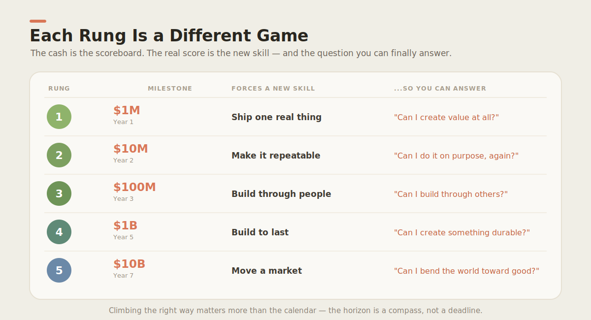
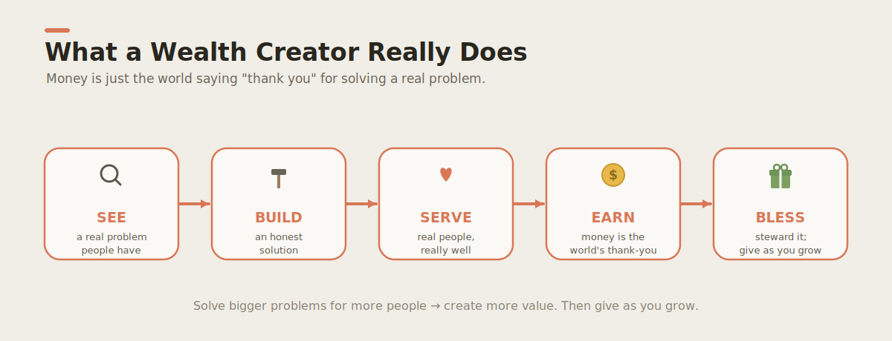
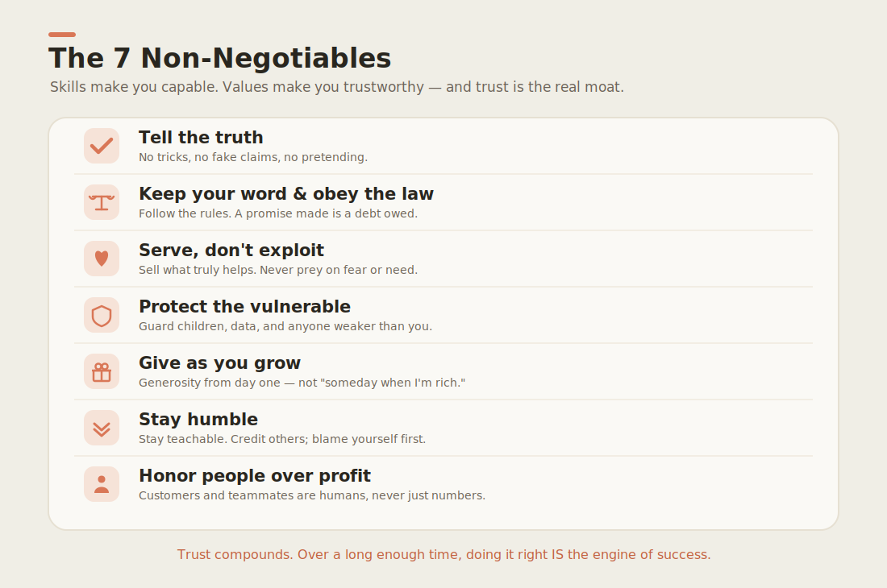

# I'm Raising My Two Sons to Build Billion-Dollar Companies for the Kingdom of God — In Public, On GitHub, With AI

### A father's open-source experiment in raising the next generation of wealth creators. Simple enough for a 10-year-old. Cited enough for a skeptic. Built in the open so your kids can join mine.

*~12 minute read · every claim below is backed by a peer-reviewed study or a Bible verse · all the artwork is real and lives in the [repo](https://github.com/wjlgatech/daniel-and-david)*

---

## Session 0: The confession

Most parenting advice is delivered with the calm confidence of a man who has clearly never stepped on a LEGO at 6 a.m.

I have no such confidence. I am, on most mornings, the Mr. Bean of fathers — the one trying to make breakfast, answer a work email, and stop a six-year-old from "washing" the cat, all at once, and somehow ending up with cereal in my laptop. If you came here for a polished guru, the exits are clearly marked.

But I *do* have a hypothesis, and I've bet my two sons' education on it. So I built it in the open, on GitHub, where anyone — including *your* kids — can read it, use it, laugh at it, and improve it.

Meet the project: **[Daniel & David](https://github.com/wjlgatech/daniel-and-david)**. Daniel is 11. David is 6. The repository is my attempt to raise them into **wealth creators** — people who build things the world genuinely needs, do it honestly, and steward the results for a purpose far bigger than themselves.

Here's the whole thesis in one picture.

That ladder is on purpose. It's also — I need you to hear this — **a compass, not a promise.** I'll explain why in a minute. First, let me earn the right to your attention by admitting what this is really about.

---

## Session 1: The Climb (and why the dollar signs are a trick)

Look at the ladder again. $1M, $10M, $100M, $1B, $10B. An AI director reading this is already narrowing their eyes: *"That's a fantasy timeline."* You're right. It is. **And that's the point.**

The numbers are a magician's misdirection. What I actually care about is the tiny grey text under each rung — *the skill it forces you to learn.* You cannot fake your way up this ladder. Rung 1 ($1M) only teaches one thing: **can you create value at all?** Rung 3 ($100M) teaches a completely different thing: **can you build through other people?** Each level is a new game with new rules.

> **The science:** This is the difference between *performance* and *learning*. Decades of research on expertise show that world-class skill comes not from talent or hours alone, but from **deliberate practice** — effortful work at the edge of your ability, with feedback, on tasks just beyond your current reach. (Ericsson, Krampe & Tesch-Römer, 1993, *The Role of Deliberate Practice in the Acquisition of Expert Performance*, **Psychological Review** 100(3): 363–406.) The ladder is a deliberate-practice machine: each rung is engineered to be *just* out of reach.

> **The scripture:** And the shape of it — a tiny seed that becomes the largest tree — is the oldest growth metaphor we have. *"The kingdom of heaven is like a grain of mustard seed... it is the smallest of all seeds, but when it has grown it is the largest of the garden plants and becomes a tree."* (Matthew 13:31–32). We start with a $29 rain poncho. We end, God willing, with a forest.

> **The Mr. Bean footnote:** The first time I explained "compound growth" to David, he nodded very seriously, then asked if we could compound-grow more dessert. We are still working on the difference between exponential curves and ice cream. Progress is non-linear.

Here is the same idea with the magician's trick exposed — every rung mapped to the *question it lets you finally answer:*

Cash is the scoreboard. **Capability is the score.** A kid who makes $1,000 and understands *exactly why every dollar arrived* has learned more than a kid handed $100,000.

---

## Session 2: What a wealth creator actually does (it starts with serving, not earning)

Ask a child where money comes from and they'll say "the bank" or "your phone." Ask most adults and you'll get a more sophisticated version of the same shrug.

So we teach the real answer, and it's surprisingly moral: **money is the world saying "thank you" for solving a real problem.** Earning is step *four*, not step one.

SEE → BUILD → SERVE → EARN → **BLESS**. The chain *starts* with seeing someone's problem and *ends* with generosity. The earning is just the echo in the middle.

> **The science:** This is closer to how real entrepreneurs actually behave than the "have a brilliant idea, then get rich" myth. Studies of expert founders describe **effectuation** — they start with who they are and whom they can serve, take small affordable-loss steps, and let value emerge — rather than predictive "causation." (Sarasvathy, 2001, *Causation and Effectuation*, **Academy of Management Review** 26(2): 243–263.) "Serve first, in small honest steps" isn't Sunday-school idealism; it's the documented behavior of people who build things that last.

> **The scripture:** The whole arc is the Parable of the Talents — we are given resources and judged by what we *do* with them, not what we hoard (Matthew 25:14–30). And the destination, BLESS, is explicit: *"It is more blessed to give than to receive."* (Acts 20:35). We literally put a "GIVE" jar next to the "KEEP" jar in David's first lesson.

> **The Mr. Bean footnote:** Our actual first business is **KC Matchday Basecamp** — selling rain ponchos and phone-charging to football fans. Our first "market research" involved me standing in a drizzle holding a poncho, looking exactly as dignified as you're imagining. A man asked if I was the entertainment. In a sense, sir, I always am.

---

## Session 3: How you actually *become* a builder (spoiler: not from a lecture)

Here's where the education experts lean in, because this is the part most schools get backwards.

You do not become a builder by being *told* about building. You become one by **building one real thing, watching it succeed or fail, and learning from what the world tells you back.** Then doing it again, a little stronger.

> **The science:** This loop has a century of evidence behind it. John Dewey argued learning is grounded in *experience* (Dewey, 1938, *Experience and Education*). Jean Piaget and then Seymour Papert showed children build knowledge by building *things* — "constructionism" (Papert, 1980, *Mindstorms: Children, Computers, and Powerful Ideas*). David Kolb formalized the cycle of concrete experience → reflection → concept → experiment (Kolb, 1984, *Experiential Learning*). Most strikingly, **productive failure** research shows that students who *struggle and even fail first*, before being taught, end up understanding more deeply (Kapur, 2008, *Productive Failure*, **Cognition and Instruction** 26(3): 379–424). We let the boys fail on purpose. On a $29 poncho. Cheap tuition.

> **The scripture:** And before you build, you count the cost — *"Which of you, desiring to build a tower, does not first sit down and count the cost?"* (Luke 14:28). The loop has a planning beat for a reason.

> **The Mr. Bean footnote:** Daniel's first "venture" was a lemonade stand priced for maximum confusion: $3 a cup, but free refills, but only for friends, but the friends had to bring their own cup. He grossed $6 and a profound lesson about pricing. The world taught him back. I just held the napkins.

---

## Session 4: Why an 11-year-old commands a team of AIs

Now the part that makes this not-your-grandfather's lemonade stand.

My sons are growing up at the precise moment when one person directing a team of AI agents can do what once took a hundred people. So I am not teaching them to *compete* with AI. I'm teaching them to **conduct** it — to be the mind and the conscience while the agents do the heavy lifting.

The mental model we use is dead simple. An "agent" is just a loop:

> **The science:** The idea that humans and machines form a *partnership* — each doing what it's best at — is not new hype; it's foundational computing. J.C.R. Licklider envisioned it in 1960 (*Man-Computer Symbiosis*, **IRE Transactions on Human Factors in Electronics**). Garry Kasparov, after losing to Deep Blue, discovered that a human *plus* a machine ("centaur" or advanced chess) beat either alone — the human supplies judgment, the machine supplies calculation. Economists have since documented this complementarity at scale (Brynjolfsson & McAfee, 2014, *The Second Machine Age*). The kid who can *direct* the AI out-produces the adult who fears it.

> **The scripture:** But the conscience stays human. *"The heart of man plans his way, but the LORD establishes his steps."* (Proverbs 16:9). The agent calculates the steps; the human — under God — chooses the way. We never let the robot make a values call.

> **The Mr. Bean footnote:** David thinks the AI lives inside the laptop fan, because that's the part that gets warm when it's "thinking hard." I have decided not to correct this. It is, honestly, not the worst mental model of compute thermal limits I've encountered.

---

## Session 5: The most important muscle isn't coding — it's *thinking*

Here is the load-bearing wall of the whole project, and it's the one I'd defend to any education researcher in the room.

Coding can be learned, hired, or — increasingly — automated. **Thinking clearly cannot be outsourced.** Before you build, buy, believe, or sell *anything*, you interrogate it. We use one ancient, ruthless tool: the **5W1H grid**. Six question-words, pointed at any topic.

> **The science:** Asking *why* is not filler — it is the engine of understanding. The **self-explanation effect** shows that learners who explain *why* to themselves understand far more deeply than those who just read (Chi, Bassok, Lewis, Reimann & Glaser, 1989, *Self-Explanations*, **Cognitive Science** 13(2): 145–182). Structured questioning is also the backbone of Bloom's Taxonomy of higher-order thinking (Bloom et al., 1956; revised Anderson & Krathwohl, 2001). And in an age of confident AI and viral nonsense, *"how do we know this is true?"* is the single most valuable habit a child can own. We make AI-fact-checking a homework assignment.

> **The scripture:** Scripture is weirdly pro-question. *"An intelligent heart acquires knowledge, and the ear of the wise seeks knowledge."* (Proverbs 18:15). And when you don't know? *"If any of you lacks wisdom, let him ask God, who gives generously to all without reproach."* (James 1:5). The first move is always to ask.

> **The Mr. Bean footnote:** We taught David the "Why Chain" — keep asking why. He asked why the sky is blue. I explained Rayleigh scattering. He asked why. I went deeper. He asked why. Four "why"s later I was Googling under the table like a man defusing a bomb. *Asking before believing*, it turns out, also keeps parents honest.

The beautiful part: the *exact same* 5W1H tool is wired into our AI teammates — as a skill, a workflow, a hook, and an installable plugin. **Humans and agents in this house think the same way.** That's not a gimmick; it's the entire definition of an AI-native company.

---

## Session 6: The thing money can't buy, and why we guard it

Skills make you capable. Values make you *trustworthy*. And trust, it turns out, is the only real moat.

> **The science:** This isn't soft. **Trust is measurable economic infrastructure.** Cross-country research finds that societal trust significantly predicts economic growth (Knack & Keefer, 1997, *Does Social Capital Have an Economic Payoff?*, **Quarterly Journal of Economics** 112(4): 1251–1288; see also Zak & Knack, 2001, *Trust and Growth*, **Economic Journal**). Low-trust environments pay a tax on every transaction. Honesty is not just nice — it's a competitive advantage that compounds.

> **The scripture:** Which is exactly what Proverbs said three thousand years ago: *"A false balance is an abomination to the LORD, but a just weight is his delight."* (Proverbs 11:1), and *"Whoever walks in integrity walks securely, but he who makes his ways crooked will be found out."* (Proverbs 10:9). Our first real business, KC Matchday Basecamp, has an explicit "do-not" list — no fake claims, no pretending to be an official event vendor — because we'd rather earn less honestly than more by deceiving people.

Before any big decision, we run one four-question test:

> **The Mr. Bean footnote:** "Would I be proud to explain it to my kids?" is a shockingly effective filter, mostly because my kids will absolutely repeat anything I say at the worst possible moment, to the most important possible person, at full volume. Accountability through public humiliation. Highly recommended.

---

## Session 7: This is not a curriculum. It's a *hub*. (And you're invited.)

Here's the turn. A book you finish. A *hub* you join. **Daniel & David is built to be a living thing that gets better the more people show up** — and it's designed as three hubs in one:

**1. A living learning hub.** Two age-tracked curricula (a 6-year-old's "Six Detective Words"; an 11-year-old's applied critical thinking), tied to *real* ventures, with the infographics you've seen as the visual backbone. New lessons, translations, and corrections come from contributors worldwide.

**2. A tools hub for AI agents.** Every capability we teach a human, we also teach our AIs — as **skills, plugins, workflows, and hooks**, all in the open, all installable. It's a working library of how to extend an AI-native company, doubling as a textbook.

**3. A hub where AI and people exchange ideas, match up, and build.** The endgame: a place where a parent in Lagos, a 12-year-old in São Paulo, an AI director in Berlin, and an agent swarm can meet, swap ideas, *match into teams,* and launch ventures that solve real, foundational problems.

> **The science:** Why open it up instead of guarding it? Because **open, networked collaboration outproduces closed effort** for this kind of work. Eric Raymond's study of open-source development ("given enough eyeballs, all bugs are shallow") and Yochai Benkler's analysis of *commons-based peer production* (Benkler, 2006, *The Wealth of Networks*) show that distributed contributors, loosely coordinated, can outbuild centralized teams. And mentorship across skill levels has a name in developmental psychology: Vygotsky's **Zone of Proximal Development** — we learn fastest with a more-capable guide just ahead of us (Vygotsky, 1978, *Mind in Society*). In a hub, every kid has a thousand guides.

> **The scripture:** The case for *together* is ancient and emphatic: *"Two are better than one, because they have a good reward for their toil... A threefold cord is not quickly broken."* (Ecclesiastes 4:9–12). And on how we sharpen each other: *"Iron sharpens iron, and one man sharpens another."* (Proverbs 27:17). A hub is just iron, at scale.

> **The Mr. Bean footnote:** I once tried to assemble flat-pack furniture "as a team" with both boys. We produced a bookshelf that is, technically, a modern art installation. But we produced it *together*, and David named it "Kevin." Kevin lives in the hallway. Collaboration is messy. Do it anyway.

---

## Session 8: The invitation (yes, you, and yes, your kids)

If you've read this far, you're my kind of person, and there's a job for you.

**Parents and educators:** come add a lesson, fix an explanation, translate a page into your language, or just open an issue telling us what your kid found confusing. The curriculum gets better every time a real child bumps into it.

**Kids (read this part with a grown-up):** you can help build this! Improve a drawing, suggest a business idea, try a "detective words" game and tell us if it was fun. Your name goes in the project. You become a builder by *building*, and this is real.

**Engineers, designers, AI folks, founders:** the venture app needs building, the agent toolkit wants extending, and the collaboration hub needs people who can match ideas to teams. Come find your unfair contribution.

> **The scripture I'm raising them on:** *"Train up a child in the way he should go; even when he is old he will not depart from it."* (Proverbs 22:6). I can't guarantee my sons will reach the top of that ladder. No father can. But I can guarantee the *direction* — honest, generous, courageous, faithful builders who use whatever they create to bless other people. If they get there the right way, we won. If they don't, but they're *that* — we still won.

Come build with us. 🌱

**→ [github.com/wjlgatech/daniel-and-david](https://github.com/wjlgatech/daniel-and-david)**

---

### References & Sources

*Every claim above is anchored to one of these. Where I cited scripture, I used the English Standard Version (ESV).*

**Scientific & scholarly**
- Bloom, B. S., et al. (1956). *Taxonomy of Educational Objectives.* / Anderson, L. & Krathwohl, D. (2001). *A Taxonomy for Learning, Teaching, and Assessing.*
- Benkler, Y. (2006). *The Wealth of Networks: How Social Production Transforms Markets and Freedom.* Yale University Press.
- Brynjolfsson, E. & McAfee, A. (2014). *The Second Machine Age.* W. W. Norton.
- Chi, M. T. H., Bassok, M., Lewis, M. W., Reimann, P. & Glaser, R. (1989). Self-Explanations. *Cognitive Science,* 13(2), 145–182.
- Dewey, J. (1938). *Experience and Education.*
- Ericsson, K. A., Krampe, R. Th. & Tesch-Römer, C. (1993). The Role of Deliberate Practice. *Psychological Review,* 100(3), 363–406.
- Kapur, M. (2008). Productive Failure. *Cognition and Instruction,* 26(3), 379–424.
- Knack, S. & Keefer, P. (1997). Does Social Capital Have an Economic Payoff? *Quarterly Journal of Economics,* 112(4), 1251–1288.
- Kolb, D. A. (1984). *Experiential Learning.*
- Licklider, J. C. R. (1960). Man-Computer Symbiosis. *IRE Transactions on Human Factors in Electronics.*
- Papert, S. (1980). *Mindstorms: Children, Computers, and Powerful Ideas.*
- Raymond, E. S. (1999). *The Cathedral and the Bazaar.*
- Sarasvathy, S. D. (2001). Causation and Effectuation. *Academy of Management Review,* 26(2), 243–263.
- Vygotsky, L. S. (1978). *Mind in Society: The Development of Higher Psychological Processes.*
- Zak, P. J. & Knack, S. (2001). Trust and Growth. *The Economic Journal,* 111(470), 295–321.

**Scripture (ESV)**
- Matthew 13:31–32 (mustard seed) · Matthew 25:14–30 (talents) · Luke 14:28 (count the cost) · Acts 20:35 (more blessed to give) · Proverbs 10:9; 11:1 (integrity) · Proverbs 16:9 (the LORD establishes his steps) · Proverbs 18:15 (the heart acquires knowledge) · Proverbs 22:6 (train up a child) · Proverbs 27:17 (iron sharpens iron) · Ecclesiastes 4:9–12 (two are better than one) · James 1:5 (ask for wisdom).

---

*Written with my AI teammate, edited by me, and accountable to two small humans who will fact-check me at dinner. — for Daniel & David.*
