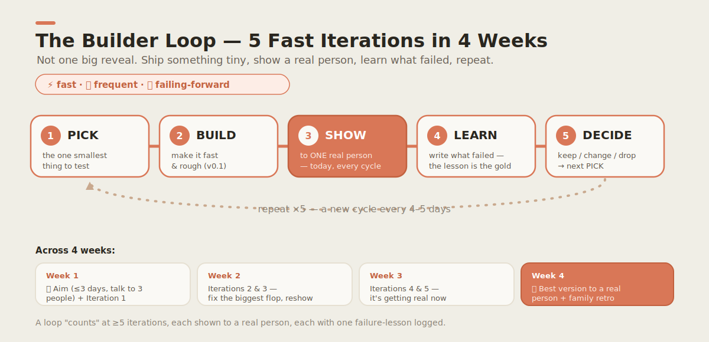

# The Builder Loop 🛠️

### A four-week family experiment in thinking, making, serving, and learning with AI

This is the **atomic unit** of everything in this repo. Not a giant curriculum, not a global
hub — one small loop a family can actually run, finish, and repeat.

> **The promise, in one sentence:** in four weeks, a child notices a real problem, understands
> it by talking to real people, builds the smallest useful thing, gives it to one real person,
> and tells the truth about what happened.

AI is the child's **teammate** the whole way — but the child stays the **mind and the
conscience**. The rule: *form your own first attempt before you ask the AI.* (See
[`docs/principles/values.md`](../principles/values.md) and the
[mission](../vision/mission.md).)

> 🖨️ **Want to just run it?** Print the **[one-page family sheet](printable.md)** — the whole
> loop with tick-boxes and reflection lines, no scrolling required.

---

## The loop at a glance

<p align="center"></p>

```text
Week 1  NOTICE    Find one real problem worth solving.
Week 2  UNDERSTAND  Ask better questions. Talk to three real people. Don't build yet.
Week 3  BUILD     Make the smallest useful solution. AI only after your first human attempt.
Week 4  SERVE     Give it to one real person. Learn from feedback. Tell the truth.
```

Every week has the **same six parts**, so it becomes a habit, not a surprise:

| Part | What it is |
|---|---|
| 🧒 **Child activity** | The one thing the child does this week. |
| 👪 **Parent guide** | What the adult sets up, watches for, and protects. |
| 🤖 **AI exercise** | One supervised use of an AI teammate — *after* a human first attempt. |
| 🧠 **Independent thinking task** | One thing the child must do *without* AI, to keep their own judgment strong. |
| 🌍 **Real-world action** | One step that touches a real person or place (not a screen). |
| 📓 **Reflection question** | One honest question to answer out loud or in the journal. |

---

## Week 1 — NOTICE

**Goal:** leave the week with *one* written problem statement the child chose.

- 🧒 **Child activity:** keep a "Problem Hunt" list for the week — write down anything that is
  *annoying, unfair, expensive, confusing, or missing.* Pick the one that matters most.
- 👪 **Parent guide:** don't fix the problems for them, and don't judge the list. Your job is
  to ask "what made that annoying?" and help them choose one, not to choose it for them.
- 🤖 **AI exercise:** *after* the child names a problem in their own words, ask an AI teammate
  to "name three other people who might have this same problem." Compare to the child's guess.
- 🧠 **Independent thinking task:** the child writes the problem as one sentence — *who* has it
  and *why it hurts* — with no AI help.
- 🌍 **Real-world action:** notice the problem somewhere real this week and point at it.
- 📓 **Reflection:** "Whose problem is this, really — and how do I know it's real?"

## Week 2 — UNDERSTAND

**Goal:** understand the problem before building anything. Resist the urge to build.

- 🧒 **Child activity:** run the **5W1H grid** on the problem (Who/What/Where/When/Why/How) —
  see [Critical Thinking](../curriculum/critical-thinking/). Then **talk to three real people**
  who might have the problem and write down what they actually say.
- 👪 **Parent guide:** set up the three conversations safely (you are present; see
  [child-safety](../safety/child-safety.md)). Coach the child to *listen more than talk.*
- 🤖 **AI exercise:** ask the AI to suggest five questions to ask a person with this problem —
  then the child picks the two best and explains *why*, rejecting the weak ones.
- 🧠 **Independent thinking task:** after the three conversations, the child writes one
  sentence: "The real need is ___" — in their own words, not the AI's.
- 🌍 **Real-world action:** the three real conversations.
- 📓 **Reflection:** "What did a real person say that surprised me?"

## Week 3 — BUILD

**Goal:** the *smallest useful thing.* A sign, a list, a kit, a one-page site, a drawing.

- 🧒 **Child activity:** make the smallest version that could actually help one person.
  Finished and tiny beats big and abandoned.
- 👪 **Parent guide:** hold the line on *small.* If it can't be done this week, it's too big —
  cut it down together.
- 🤖 **AI exercise:** the child makes a **first human attempt**, *then* asks the AI to improve
  it — and must **independently reproduce or explain** the key part the AI changed. (If they
  can't explain it, they don't ship it.)
- 🧠 **Independent thinking task:** find **one mistake the AI made** and explain how they
  checked. (AI is a teammate, not an oracle.)
- 🌍 **Real-world action:** show the rough version to one person and watch their face.
- 📓 **Reflection:** "What did I make myself, and what did the AI help with — honestly?"

## Week 4 — SERVE

**Goal:** one real person is genuinely helped, and the child tells the truth about it.

- 🧒 **Child activity:** give the thing to **one real person.** Ask them: what helped? what
  failed? what should change? Write down all three answers.
- 👪 **Parent guide:** make sure the "customer" is safe and appropriate, and that any money,
  if involved, follows the [venture guardrails](../../ventures/kc-matchday-basecamp/SPEC.md).
- 🤖 **AI exercise:** ask the AI to summarize the feedback into "keep / change / drop" — then
  the child decides which advice to take and which to reject, with a reason.
- 🧠 **Independent thinking task:** apply the **[4-Question Test](../principles/values.md)** to
  the finished thing: *Is it true? Is it legal and is my word kept? Does it serve someone?
  Would I be proud to explain it?*
- 🌍 **Real-world action:** the real hand-off to a real person.
- 📓 **Reflection:** "Did I really help someone — and what would I do differently next loop?"

---

## How we know it worked (measurable outcomes)

The loop is not graded on participation. For each child, after the loop, we look for
**Independent Builder Evidence** — see the [Theory of Change](../vision/theory-of-change.md).
A loop "counts" when the child can independently do at least **four** of these:

| Capability | What "done" looks like |
|---|---|
| Explain | State the problem and the solution in their own words. |
| Question | Find one unsupported claim and say what evidence would change their mind. |
| Interview | Run one real conversation and summarize the person's true need. |
| Test | Show their thing to a real person and report honest feedback. |
| Build | Point to an artifact they made. |
| Revise | Name one thing they changed *because* of feedback. |
| Verify AI | Show one AI mistake they caught and how they checked. |
| Choose honesty | Name one shortcut they refused, and why. |

> **For parents/mentors:** the [curriculum tracks](../curriculum/) give age-tuned versions of
> each week — [Daniel (11)](../curriculum/daniel-age-11/) goes deeper on pricing and code;
> [David (6)](../curriculum/david-age-6/) does the same loop with drawings, counting, and
> greeting the customer.

> **Safety first.** Every real-world and AI step in this loop assumes adult supervision and the
> rules in [`docs/safety/`](../safety/). Read those before you run the loop with a child.
