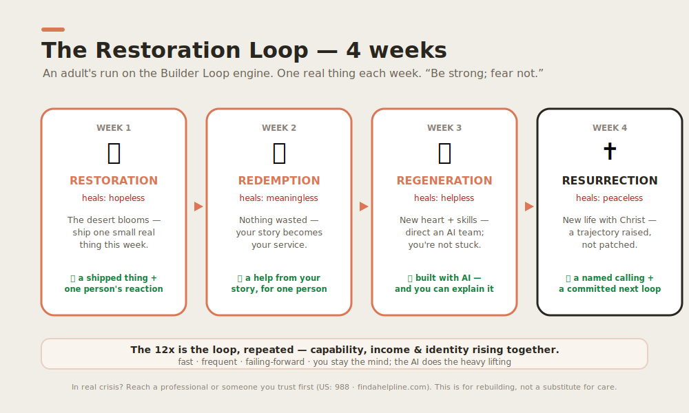

# The Restoration Loop — an adult's 4-week run 🌿

*The grown-up parallel to the [Builder Loop](../../builder-loop/). For anyone in a dry season —
the AI-disrupted, the single parent, the laid-off, the **old in skin, young at heart** — rebuilding
their trajectory one small, real step at a time.* Grounded in the
[Isaiah 35 Restoration Track](../../vision/isaiah-35-restoration.md).

> **Status: 🟡 in design.** A complete, runnable draft you can do on paper today; not a shipped
> program. We tell the truth about stage (see [values](../../principles/values.md)).

> 💛 **If you're in real crisis** — thinking of harming yourself, or unable to keep yourself safe —
> please reach out to a professional or someone you trust *first*. In the US you can call or text
> **988** (Suicide & Crisis Lifeline); elsewhere, find your local line at
> <https://findahelpline.com>. This loop is for rebuilding, not a substitute for care, a doctor, a
> counselor, or a pastor. Getting help is a step of strength, not weakness.

---

## The shape: 4 weeks, the 4 R's, one real thing each week

Same engine as the kids' loop — **fast · frequent · failing-forward** — but each week also heals one
of depression's four lies. Every week pairs **inner work** (renew the mind) with **outer work** (one
Builder Loop cycle: pick the smallest next thing → build it rough with an AI teammate → show one real
person → write the one lesson). You stay the **mind and the conscience**; the AI does the heavy
lifting. The rule holds: *form your own first attempt before you ask the AI, then check its work.*

| Week | Principle | Heals the lie | The week's real output |
|---|---|---|---|
| **1** | 🌱 **Restoration** | *hopeless* | one real thing shipped + one real person's reaction |
| **2** | 🔁 **Redemption** | *meaningless* | a small help, drawn from your own story, that served one person |
| **3** | 🧠 **Regeneration** | *helpless* | something built **with an AI team** you couldn't make a month ago |
| **4** | ✝️ **Resurrection** | *peaceless* | a named calling + a committed **next** loop (the trajectory, raised) |

> ▶️ **To run it:** copy the **[weekly worksheet](worksheet.md)** (one block per week), or do it in
> the [Builder Loop app](https://wjlgatech.github.io/daniel-and-david/app.html) — it keeps everything
> on your device. The new conversational [Builder Loop Coach](../../../apps/web-agent/) can walk you
> through it by voice (in design).

---

## Week 1 — 🌱 Restoration · *the desert blooms*

> *"The wilderness… shall blossom… For waters break forth in the wilderness, and streams in the
> desert."* — Isaiah 35:1,6. The lie says *it's too late, nothing will grow.* The truth: **hope is
> proven by one small thing you do with your own hands.**

**Inner work (20 min).**
1. Name your desert in one honest sentence (the loss, the disruption, the stuck place).
2. Read Isaiah 35:3–4 slowly: *"Strengthen the weak hands… say to the anxious heart, 'Be strong;
   fear not.'"* Write what "be strong, fear not" would look like as **one believable next step** this
   week — small enough you're almost sure you can do it.

**Outer work (one Builder Loop cycle, ~4 days).**
- **Pick** the smallest next thing you can ship that helps one real person.
- **Build** it rough with an AI teammate (a page, a note, an offer, a fix). Your first attempt first.
- **Show** it to one real person. Watch what actually happens.
- **Learn:** write what failed and **the one lesson** (the failure is the gold).

**Output (evidence):** one real thing shipped + what the real person said. *Hope returns when the
desert grows one green thing.*
**Verify the AI:** write one mistake the AI made and how you caught it.

---

## Week 2 — 🔁 Redemption · *nothing is wasted*

> *"The ransomed of the LORD shall return… with singing."* — Isaiah 35:10. *"I will restore the years
> the locust has eaten."* — Joel 2:25. The lie says *my past disqualifies me.* The truth: **your scar
> is your map** — you are uniquely made to help the person still in the pit you climbed out of.

**Inner work (20 min).**
1. List **3 hard things you've survived.** For each: *who else is in that pit right now, and what
   would have helped me when I was there?*
2. Circle the one where you feel the most "I wish someone had done X for me."

**Outer work (one cycle).** Aim this week's loop at **that** problem. Build a small thing — a guide,
a service, a checklist, a kind message, a tool — for **one person** in that pit. Show it to them.
Learn.

**Output:** a small thing, drawn from your own story, that served one real person.
**Verify the AI:** one AI mistake caught.

---

## Week 3 — 🧠 Regeneration · *new heart, new skills*

> *"Then the eyes of the blind shall be opened… the lame man leap like a deer."* — Isaiah 35:5–6.
> *"A new heart… a new spirit."* — Ezekiel 36:26. The lie says *I can't, I'm too old, I don't have
> the skills.* The truth: **one person directing an AI team can do today what took a hundred people
> yesterday** — and your self-image can be rebuilt with your capability.

**Inner work (20 min).**
1. Write down **one lie you believe about yourself** ("I'm not technical," "I'm too late," "I always
   fail"). Rewrite it as a truth you're willing to test this week.
2. Name **3 talents** people have actually thanked you for. These are clues to your design.

**Outer work (one cycle).** Use an **AI teammate** to make something you *couldn't have made a month
ago* — and you stay the mind: you must be able to **explain it.** (New here? Start with
[`agents/hello-agent/`](../../../agents/hello-agent/) and
[agentic engineering](../../principles/agentic-engineering.md).)

**Output:** something built with an AI team that you couldn't have built before — *and you can
explain how it works.*
**Verify the AI:** one AI mistake caught and corrected.

---

## Week 4 — ✝️ Resurrection · *a trajectory raised*

> *"…united with him in a resurrection like his."* — Romans 6:5. *"I will not leave you as orphans."*
> — John 14:18. The lie says *this is all there is; there's no peace.* The truth: **new life, not a
> patched-up old one** — and peace that comes from knowing **Whose** you are, not from the scoreboard.

**Inner work (25 min).**
1. Name the shift you've felt this month: from **orphan** (rejected, on my own, earning my worth) →
   toward **beloved** (chosen, named, sent). Write one sentence of evidence.
2. Draft your **one-line calling**: *"I'm made to ______ for ______."* (It can be rough — you'll
   refine it over many loops.)

**Outer work (one cycle).** Commit to the **next** loop. Write a simple 4-week plan for the
trajectory you're now on, and make it real by **telling one person** ("Here's what I'm building
next"). A public micro-commitment is how a raised trajectory keeps rising.

**Output:** a named calling + a committed next loop, told to one real person.
**Verify the AI:** one AI mistake caught.

---

## After 4 weeks: the 12x is the loop, repeated

A "12x" trajectory is not one heroic leap — it's **many small loops compounding.** Capability,
income, and identity rise together up the [Capability Ladder](../../vision/milestones.md): notice a
real problem → ask good questions → make something useful → serve one real person → learn from
feedback → work with a team → use what you build to bless others. Run the loop again. And again.

## Measure capability, not participation

Like the rest of the [curriculum](../README.md), a week isn't "done" because you sat with it. Check
yourself against four marks:

| Checkpoint | The question |
|---|---|
| **Before** | What did you believe you *couldn't* do or *weren't*? |
| **During** | What did you actually ship, and to whom? |
| **After** | What can you now *independently* do, make, or explain? |
| **Transfer** | Could you run this loop again next month, on a new problem, alone? |

The honest measure (mirroring our [North Star](../../vision/theory-of-change.md)): **independent
evidence of a rebuilt trajectory, month over month** — a shipped thing, a served person, a returning
hope.

## A few honest words for the road

- **Small and real beats big and someday.** A finished tiny thing this week is worth more than a
  perfect plan you never start.
- **Let reality, not fear, give the feedback.** Show one real person every week.
- **You are not your résumé or your worst season.** You are made to create, to serve, and to bless —
  and it is not too late. *Be strong; fear not.*

Related: [Isaiah 35 Restoration Track](../../vision/isaiah-35-restoration.md) ·
[The Builder Loop](../../builder-loop/) · [Values](../../principles/values.md) ·
[weekly worksheet](worksheet.md)
