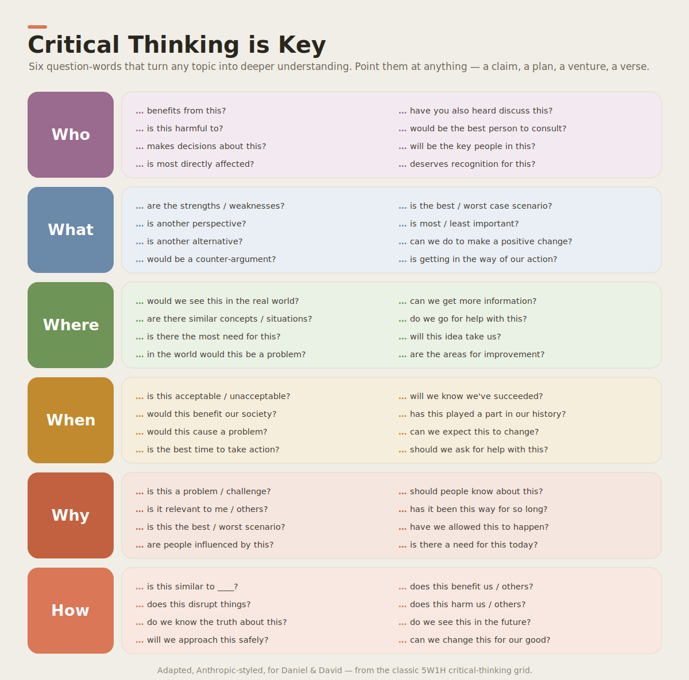

# Thinking Tool: Critical Thinking (5W1H)

A **wealth creator's most important muscle isn't coding or selling — it's *thinking clearly*.**
Before you build, buy, believe, or sell anything, you interrogate it. This is the tool we use.

## What it is

Six question-words — **Who · What · Where · When · Why · How** — that you can point at
*anything*: a claim someone makes, a plan you're about to follow, a product you might sell, a
news headline, even a verse you're studying. Each word opens up eight questions. Ask them and
a fuzzy topic snaps into focus.

> It's a **flashlight for your mind.** Dark corners (hidden risks, missing people, untested
> assumptions) light up the moment you point the six words at them.

## Why a builder needs it

- **Before a venture decision** — point it at the idea before spending a dollar. (Who is hurt
  by this? What's the worst case? Why hasn't someone done it already?)
- **Before believing a claim** — the world is full of confident nonsense (and confident AI).
  5W1H is how you check. See [agentic engineering: *verify, then trust*](../../principles/agentic-engineering.md).
- **Before selling** — if you can't answer "who does this genuinely serve?" honestly, don't
  sell it. See [values](../../principles/values.md).

## The two tracks

| Track | For | Framing |
|---|---|---|
| 🕵️ [David — age 6](david-age-6.md) | the apprentice | "The Six Detective Words" — a question game |
| 🧠 [Daniel — age 11](daniel-age-11.md) | the builder | The 5W1H tool applied to real decisions, claims, and venture #1 |

## For agents, too

This same framework is wired into the repo's **agent toolkit** so AI teammates think
critically before acting — a [skill](../../../.claude/skills/critical-thinking/SKILL.md), a
[dynamic workflow](../../../.claude/workflows/critical-thinking-review.js), a hook, and a
[plugin](../../../tools/critical-thinking-plugin/). Humans and agents using the *same* thinking
tool is the whole idea of an [AI-native company](../../principles/ai-native-company.md).
