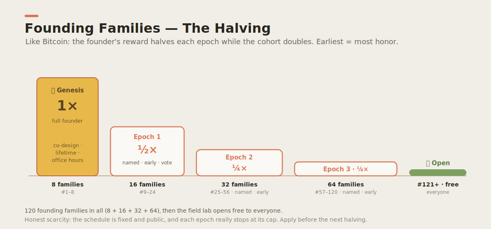

# Founding Families — The Halving 🧱

> **A rare privilege, on a provably fair schedule.** We open the family field lab to a small
> number of **founding families** — and, like Bitcoin's issuance, the founder's reward **halves**
> at each epoch while the cohort **doubles**. The earliest families take the most risk and do the
> most work, so they earn the most honor. The schedule is fixed and public. We *will* stop each
> epoch at its cap.

This is the real, near-term goal of the project (it replaces the old "ten pilot families" line in
the [Theory of Change](vision/theory-of-change.md)) — and it doubles as a living lesson for the
boys in **scarcity, early-adopter value, and provable fairness.**

---

## Why a halving (and why it's honest, not a gimmick)

Cheap "only 2 spots left!" countdowns are a lie, and they'd fail our own
[4-Question Test](principles/values.md). A halving is different:

- **It's true.** Every epoch has a real, capped number of spots. We turn away applicant #9 to
  Genesis — that's what makes "founding" mean something.
- **It's fair.** Joining early is genuinely harder and riskier (the project is unproven, and
  founders *co-build* it). Bigger reward for bigger risk — exactly like early miners.
- **It's fixed and public.** The whole schedule is below. Nothing resets. Nothing is hidden.
- **It teaches.** Daniel and David watch real people value a scarce, fairly-issued thing — the
  best possible lesson about how value actually works.

> The only honest reason to "compete to get in" is that getting in is genuinely scarce and
> genuinely worth it. Both are true here.

---

## The schedule

<p align="center"></p>

| Epoch | Families | Spots | Founder reward | What a founding family gets |
|---|---|---:|:---:|---|
| ⛏️ **Genesis** | #1–8 | 8 | **1×** (full) | **Co-design** the curriculum · permanent **"Genesis" name** in [`FOUNDERS.md`](../FOUNDERS.md) · lifetime access to everything · direct **office hours** with the founder · first pick of ventures |
| **Epoch 1** | #9–24 | 16 | **½×** | Name in `FOUNDERS.md` · early access · a **vote** on the curriculum · group office hours |
| **Epoch 2** | #25–56 | 32 | **¼×** | Name in `FOUNDERS.md` · early access · curriculum **suggestions** |
| **Epoch 3** | #57–120 | 64 | **⅛×** | Name in `FOUNDERS.md` · early access |
| 🌍 **Open** | #121+ | ∞ | → 0 | The public program — **free and open to all.** No application needed. |

**Total founding families before the program opens: 120** (8 + 16 + 32 + 64). After that, the
whole field lab is free and open — the founders helped build the thing everyone else gets to use.

> **Current epoch: ⛏️ Genesis · 8 spots.** (Status is kept honest on the
> [landing page](../apps/web/public/index.html) — a single config value, updated as families join.)

---

## What a founding family commits to

This is a *fit*, not a competition you "win." We're choosing each other. A good founding family:

- has children roughly **ages 6–12**;
- will run at least one **[Builder Loop](builder-loop/)** (4 weeks, 5 fast cycles) and **share what
  they learned** — the honest "what worked / what failed" is the gift;
- is comfortable with the project's **faith-informed** values ([values](principles/values.md));
- keeps it **safe and kind** ([safety](safety/)).

About **1 hour a week.** Small on purpose.

---

## How to apply

Apply from the **[landing page](https://wjlgatech.github.io/daniel-and-david/)** (the "Apply to
the founding cohort" form). We read every application and reply within ~2 weeks. Accepted families
are added to [`FOUNDERS.md`](../FOUNDERS.md) **by first name or alias, with consent** — never full
identity.

> **For parents, guardians, and educators only.** The application collects **adult** contact
> information only — never a child's name, age, photo, school, or location. See
> [privacy-by-design](safety/privacy-by-design.md) and the
> [privacy notice](https://wjlgatech.github.io/daniel-and-david/privacy.html).

---

## Going live (for maintainers)

The application form is **provider-agnostic** — it posts to a single endpoint set in one place in
`apps/web/public/index.html`:

```js
const FORM = { provider: "none", endpoint: "" };  // ← set this to go live
```

- `provider: "none"` (default) → the form falls back to a **mailto:** so nothing is lost before a
  provider is chosen.
- Pick a provider and paste its endpoint to go live. Recommended for this brand:
  - **Tally** — EU data residency (Belgium), unlimited free tier, multi-field + consent. Best
    privacy story for a family brand. (Embed/redirect.)
  - **Formspree** — simplest pure-HTML `action=` endpoint, 50 submissions/mo free (plenty for a
    120-family cap), built-in `_gotcha` honeypot, DPA on request.
- Then update the [privacy notice](../apps/web/public/privacy.html) with the chosen processor.

The form already includes the **honeypot, the adults-only notice, and the consent checkbox**;
`scripts/check-registration-safety.sh` fails the build if any of those go missing.
