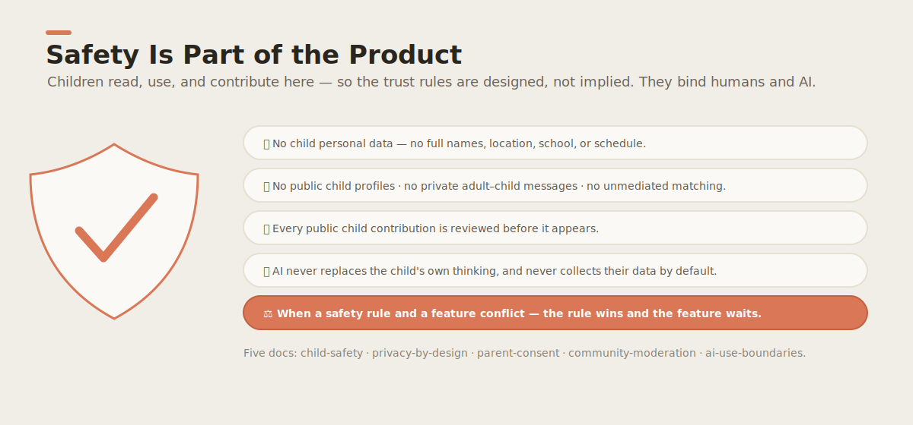

# Safety & Trust 🛡️

Children read, use, and contribute to this repo. So safety is not a disclaimer bolted on at
the end — **it is part of the product.** This folder is the visible governance layer that has
to exist *before* we build accounts, profiles, uploads, matching, or messaging.

| Doc | What it covers |
|---|---|
| [child-safety.md](child-safety.md) | The hard rules that protect children here. |
| [privacy-by-design.md](privacy-by-design.md) | What data we collect (as little as possible) and why. |
| [parent-consent.md](parent-consent.md) | How a parent/guardian approves a child's participation. |
| [community-moderation.md](community-moderation.md) | How public contributions are reviewed before they appear. |
| [ai-use-boundaries.md](ai-use-boundaries.md) | What AI teammates may and may not do around children. |

> These rules apply to **humans and AI agents alike.** An agent working in this repo must
> follow them exactly — see [`AGENTS.md`](../../AGENTS.md). When a rule and a feature conflict,
> the rule wins and the feature waits.
